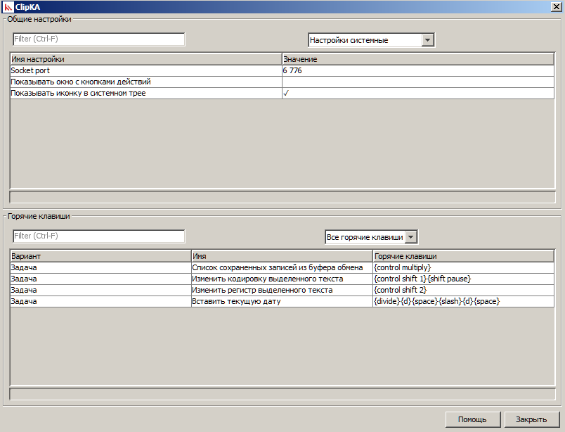
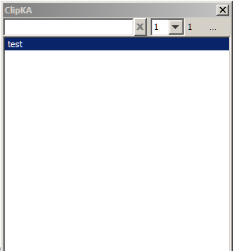
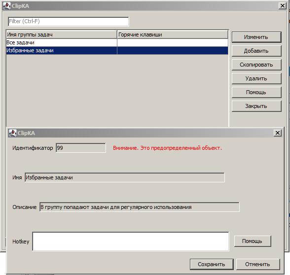
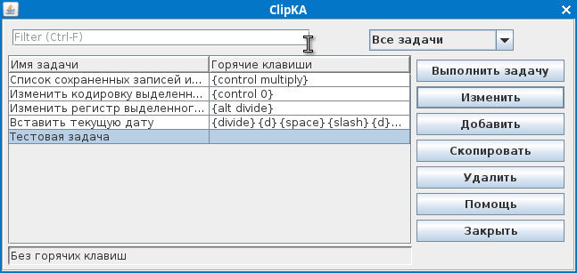
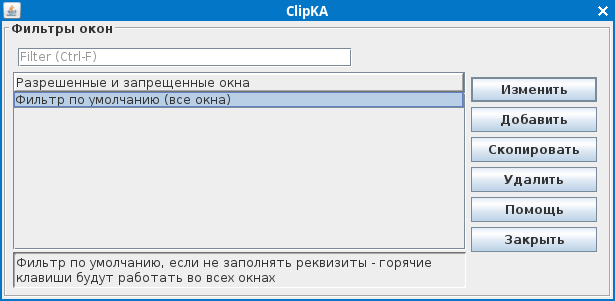
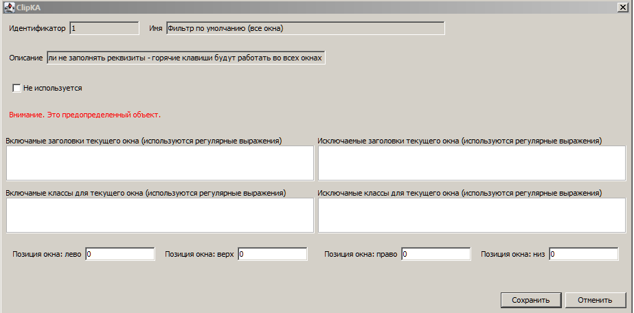
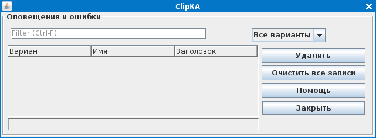

# ClipKA

Эта программа -- множественный буфер обмена и менеджер горячих клавиш.
Замена неправильной кодировки, замена неправильно набранного регистра
текста, задачи на скриптовом языке Groovy.

Ключи командной строки:  
-p [Порт], --port [Port] - изменить порт, на котором работает программа  
-t [Номер], --task [Номер] - номер команды, которую надо сразу запустить  
-g [Номер], --group [Номер] - номер группы команд, которую надо показать  

Добрый день.

За последние годы я несколько раз пытался перейти на домашнем компьютере
на Linux. Несмотря на то, что компьютер домашний, хотелось бы на нём
иметь возможность работать, а также подключаться к Windows серверам по
rdp.

И каждый раз мне не хватало нескольких программ, которые накопились за
годы работы в Windows.

Основная проблема - удобный множественный буфер обмена. В Linux жить без
подобной программы плохо, хотя бы потому, что при копировании данных в
буфер и закрытии окна программы - данные не сохраняются. Но, кроме
того, я привык видеть, какое приложение сделало запись в буфер обмена, и
в какое время. В этом случае можно использовать программу как простой
таймер для учета времени. Если данные копировались в буфер
последовательно несколько раз - должна быть возможность их удобно
получить. Все найденные программы под Linux меня никак не устраивали.

Также, хотелось быстро исправлять текст, введенный в ошибочной раскладке
или неверном (верхнем/нижнем) регистре. Кроме того, у меня на autohotkey
были написаны задачи, облегчающие работу. Ну, например, вставка
комментария с текущей датой в любом месте. На первый взгляд, в Linux с
этим все хорошо. Есть и compose key, и много скриптов на bash. Однако
едва я попробовал запустить их в сессии rdp, как выяснилось, что со всем
этим хозяйством есть огромные проблемы. Поэтому необходима программа,
которая будет производить выполнение некоторых задач. 

И если уж писать программу, хотелось бы, чтобы она работала как под
Windows, так и под Linux.

Пока это глубокая альфа, особенно в визуальной части, но программа
работает. Основные задачи по использованию буфера обмена я использую
несколько месяцев, и операционную систему Windows дома уже давненько не
запускал.

PS. Java я конечно не изучил, но переписать все уже хочется.

Тестирование

Windows 7, Windows 10.

PSLinuxOs XFCE - система на домашнем компьютере, на котором идет
основная проверка.  

***

Выложенная программа содержит несколько примеров задач, например, проверка того, что выделенный текст напечатан только в одной кодировке, обрамление одиночными кавычками выделенных в списке клипов буфера обмена строк, ввод некоторых символов, независимо от того, какая установлена раскладка.   

Задачи выполняются двумя способами: 
- проверка нажатия указанных клавиш 
- запуск программы с параметрами 

Данные хранятся в файлах sqlite, расположены в папке dat. Файлы можно
удалить, при запуске будут проинициализированы заново.

Работа с текстом.   
Как в общем случае можно обработать выделенный текст в любом поле ввода. Можно послать сочетание клавиш для копирования, дождаться появления текста в буфере обмена (в некоторых случаях это может занимать достаточно продолжительное время). Обработать полученный текст. Вставить новый текст в позицию курсора. И вот есть 2 варианта:
1 - послать сочетание клавиш для вставки текста. 2 - послать специальное сочетание символов в виде набора кодов, который будет соответствовать символу. Для системы Windows - это клавиша Alt. Коды соответствуют OEM кодировке текущей системы (для русского языка кодовая страница 866). Для Linux можно использовать клавишу Compose. В папке с установленной программой находится файл .XCompose, в котором описаны коды, аналогичные кодам в Windows.
На самом деле, первый вариант достаточно надежный, если не брать в расчет некоторые терминалы, для которых необходимо указывать специальные клавиши вставки. Второй вариант лучше использовать только для вставки коротких текстов. 

## Ограничения  

Версия Java 11

Пока не работает на 32 разрядном Linux.

Некрасиво отображается системный трей в окружении Cinnamon. Причем эти
проблемы даже у тестовой программы java. Вместо трея лучше запускать
обычное окно с кнопками действий.

Горячие клавиши не работают с дисплейным сервером Wayland. Функции для
отслеживания нажатий клавиш используют X11. Работает множественный буфер обмена. Задачи можно запускать с помощью командной строки.

Минимальная версия Windows для работы программы: Windows Vista

Для проверки запуска приложения и запуска задач с помощью командной
строки открывается порт на компьютере. Для запуска нескольких приложений
нужно использовать разные порты.

Нет защиты базы с записями буфера обмена. Можно ограничить запись в
базу, фильтруя заголовки/классы окон.

## Настройки

Системные настройки

Socket port. При первом запуске программа резервирует указанный порт.
При повторном запуске порт проверяется и не дает запустить вторую копию
программы. Еще одно использование - запуск задачи из командной строки.

Показывать окно с кнопками действий. У программы имеется обычное окно с
кнопками основных действий. Возможна ситуация, когда системный tray
недоступен. Тогда должно показываться данное окно (это действие по
умолчанию). При установке флажка окно будет показываться всегда.

Показывать иконку в системном трее. Если флажок не установлен,
показывается окно с кнопками действий.

Показывать уведомление, если задача завершена с ошибкой. Если флажок установлен, после задачи, которая завершена с ошибкой, показывается всплывающее окно уведомлений. В любом случае, записи можно посмотреть в окне 'Оповещения и ошибки'

Время в секундах для всплывающего окна уведомления по умолчанию. Если значение равно нулю, окно уведомлений не закрывается.  

Настройки для буфера обмена

Количество записей на странице. При открытии списка клипов буфера обмена
на экране показывается указанное количество клипов.

Максимальный размер текста. Ограничение размера текста при копировании в буфер.

Поиск в списке клипов без учета раскладки клавиатуры. При установленном флажке поиск будет происходить, даже если выбрана другая раскладка клавиатуры.  

Удалить дубликаты текстов в буфере. При вставке клипа проверяются клипы
с таким же содержимым. Чтобы не набирать дубликаты в писке клипов - их
можно удалять. Следует иметь в виду, что при удалении дубликатов можно
потерять информацию о времени создания и источнике текста в буфере.

Время в секундах, после которого прекращается запоминание позиции в
списке клипов. Для удобного выбора нескольких идущих последовательно
клипов, при открытии списка сохраняется предыдущая позиция. После
указанного времени - список клипов открывается, начиная с самых
последних.

Разделитель текстов клипов при выделении нескольких в списке клипов. При выделении нескольких клипов в списке их можно получить одной строкой. Каждый клип будет отделяться от другого указанным текстом (по умолчанию используется перенос строки).  

Строка для конвертирования ошибочных раскладок клавиатуры. На данный момент конвертирование происходит только для 2-х раскладок.  

Строка для конвертирования ошибочно набранного регистра букв.   

Отслеживать буфер обмена: выделение - настройка видна только в Linux.
По умолчанию выделение не отслеживается.

## Окно сохраненных текстовых клипов буфера обмена.

Показывается список клипов с указанием времени копирования, заголовка и
класса окна владельца. Для системы Linux дополнительно показывается
буфер обмена: обычный или выделение. При выборе клипа запоминается
текущая позиция. При повторном открытии списка курсор устанавливается на
предыдущий клип. Позиция курсора сбрасывается после истечения времени,
указанного в настройках.  
Выделенные строки в списке клипов автоматически объединяются в общую строку, с разделителем, указанным в настройках.  
Можно выполнить задачи, попадающие в специальную группу.  

## Группы задач

Задачи можно сгруппировать. При открытии группы задач, можно
посмотреть/запустить задачи только из указанной группы. У группы можно
указать горячие клавиши. При вводе этих клавиш открывается список задач
с отбором по выбранной группе.

## Задачи

Можно выполнять действия над строками, полученными из буфера обмена или
выделенными в текстовом редакторе. Каждая задача состоит из списка
подзадач, выполняемых последовательно.

Обмен данными между подзадачами ведется с помощью специального
хранилища- словаря, куда можно поместить текстовое содержимое, указав
любой код, а также получить обратно. Если код словаря пустой - работаем
с текущей обрабатываемой строкой.

Необходимо принять во внимание, что есть две специальные подзадачи:
копирование в буфер обмена и вставка из буфера. Несмотря на указание
сочетаний клавиш, эти подзадачи особые. В некоторых случаях (например,
при работе с сервером RDP) обновление буфера обмена может занимать
длительное время и нельзя использовать просто имитацию нажатия клавиш.
Необходимо дождаться реального обновления буфера.

Существующие подзадачи:

"Посылать символ(ы), имитируя ввод на клавиатуре" - Можно безопасно
использовать только для клавиш, которые не зависят от раскладки
клавиатуры. Не стоит использовать для передачи текста.  
"Попытаться скопировать выделенный текст в буфер обмена" - Несмотря
на указание горячей клавиши, это не просто имитация нажатия клавиш.
Операция пытается именно скопировать значение в буфер обмена, ожидая
ответа.  
"Попытаться вставить текст из буфера обмена в текущую позицию курсора" - Несмотря на указание горячей клавиши, это не просто имитация нажатия клавиш. Операция пытается именно вставить значение из буфера обмена  
"Посылать символ(ы), используя специальную клавишу Compose (для системы
Windows - Alt)" - Отсылает коды клавиш с помощью специально настроеной
клавиши Compose (для системы Windows - Alt). Может являться аналогом
вставки из буфера обмена  
"Получить строку из буфера обмена и поместить в словарь"  
"Сохранить указанную строку в буфер обмена"  
"Введенную в содержание строку сохранить как текущую обрабатываемую"  
"Сохранить текущую обрабатываемую строку в словарь"  
"Получить текущую обрабатываемую строку из словаря"  
"Удалить строку из словаря (если больше не нужна)"  
"Изменить кодировку текста"  
"Изменить регистр текста"  
"Поместить в список клипов"  
"Прочитать строку из списка клипов" - Если в содержании указано число, оно интерпретируется как смещение от последнего клипа. Число 0 - последний клип. Если содержание пустое и задача выполняется из списка клипов - получает выделенные строки. Если содержание пустое и задача выполняется самостоятельно - получает последний клип.  
"Показать окно оповещения" - Показывает окно оповещения, если заполнена текущая обрабатываемая строка. В содержание можно занести время в секундах, в течение которого будет открыто окно.  
"Показать окно уведомления об ошибке" - Показывает окно уведомления об ошибке, если заполнена текущая обрабатываемая строка. В содержание можно занести время в секундах, в течение которого будет открыто окно.  
"Записать оповещение в таблицу 'Оповещения и ошибки'" - Записывает текущую обрабатываемую строку как оповещение в таблицу 'Оповещения и ошибки'. В содержание можно занести имя оповещения.  
"Записать ошибку в таблицу 'Оповещения и ошибки'" - Записывает текущую обрабатываемую строку как ошибку в таблицу 'Оповещения и ошибки'. В содержание можно занести имя ошибки. 
"Очистить таблицу 'Оповещения и ошибки'"  
"Выполнить код на языке Groovy" - В содержание заносится код на языке Groovy. Можно использовать переменные result, result1...result9. В переменную result заносится текущая обрабатываемую строку. После возврата в текущую обрабатываемую строку записывается последнее значение или значение, находящееся в переменной result. Остальные переменные можно получить из хранилища по кодам 1...9.   
"Показать/скрыть сохраненный список буфера обмена"  
"Показать сохраненный список клипов буфера обмена"  
"Скрыть сохраненный список клипов буфера обмена"
"Получить свойства текущего окна"

## Фильтры окон

Задача может выполняться только в указанном окне или позиции экрана.
Можно указать в формате регулярных выражений разрешенную или запрещенную
комбинацию символов    в заголовке или классе окна. Можно, например,
использовать фильтр, чтобы не копировать в список клипов сохраненные
пароли.

## Оповещения и ошибки

Это отдельная таблица, в которую автоматически попадают ошибки при
выполнении задач. Кроме того вы можете сами записывать туда текст, чтобы
потом анализировать.
